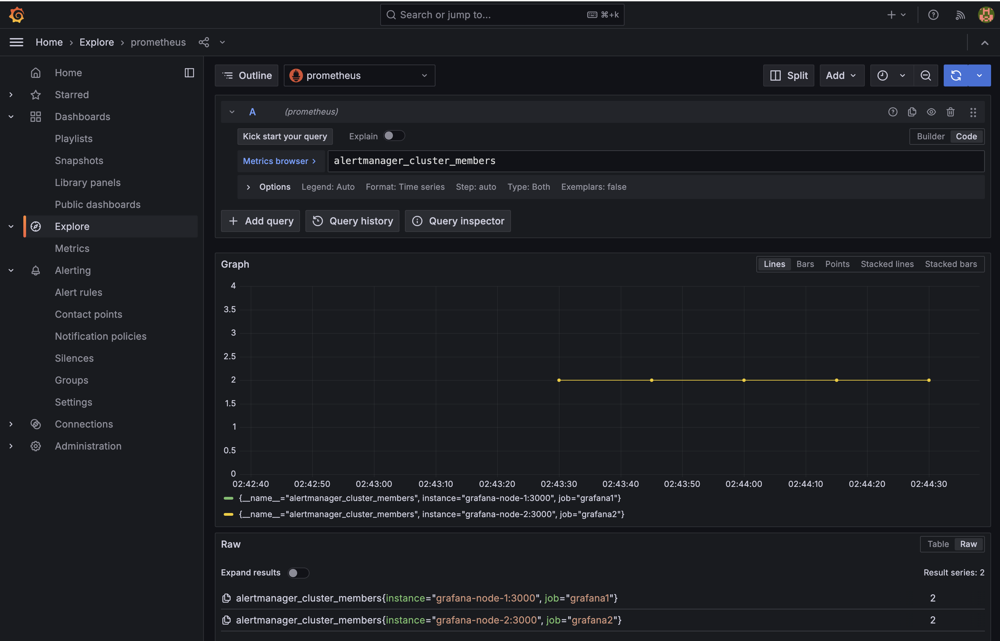

# Demo of Grafana Alerting High Availability using Redis and Docker Compose

This example project demonstrates the setup of Grafana Alerting in high availability (HA) mode using Docker compose, Redis, and PostgreSQL. 

### Pre-requisites:
- [Docker Compose](https://docs.docker.com/compose/install/)

### Run Grafana using Docker compose

To start Grafana, run the [docker-compose.yaml](./docker-compose.yaml) using the following command:

```bash
docker compose up -d
```

This command starts two Grafana instances, Prometheus, nginx, and PostgreSQL.

```bash
 ✔ Network redis_default                         Created          0.0s
 ✔ Container prometheus                               Started          0.0s
 ✔ Container redis                                    Started          0.0s
 ✔ Container postgres                                 Healthy          0.1s
 ✔ Container grafana-node-1                           Started          0.0s
 ✔ Container grafana-node-2                           Started          0.0s
 ✔ Container nginx                                    Started          0.0s
```

After running the Docker compose setup, you can access Grafana at [localhost:8080](http://localhost:8080). 

You can now verify that Alertmanager HA is working by querying the `alertmanager_cluster_members` metric to find the number of instances in the cluster.



### Configuration 

To learn more about the configuration of this Grafana stack, review the setup in the [docker-compose.yaml](./docker-compose.yaml) file:

- Redis is used to enable alerting high availability by setting `ha_redis_address` and `ha_redis_prefix` via environment variables.
- PostgreSQL is configured to share data between the two Grafana instances.
- nginx is used to forward incoming requests on port 8080 to the different Grafana instances.
- The Prometheus instance scrapes metrics from the two Grafana instances to monitor the cluster status.

For more detailed information about Grafana high availability, refer to [Set up Grafana for high availability](https://grafana.com/docs/grafana/latest/setup-grafana/set-up-for-high-availability/) and [Configure Grafana Alerting for high availability](https://grafana.com/docs/grafana/latest/alerting/set-up/configure-high-availability/).